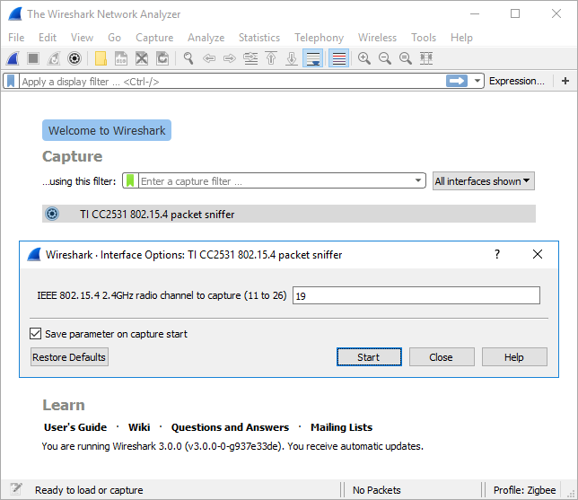

# wireshark-cc2531

Wireshark extcap interface for the Texas Instruments CC2531 USB dongle with the factory-installed IEEE 802.15.4 packet sniffer firmware.

## GNU/Linux

1. Compile the cc2531.c extcap program:
  * sh build.sh
2. Copy the resulting cc2531 executable to the wireshark extcap directory with permissions to read-write the /dev/bus/usb/XXX/YYY device node of the TI CC2531 USB dongle. One way to do this is:
  * sudo install -m 2755 cc2531 /usr/lib/x86_64-linux-gnu/wireshark/extcap/cc2531
3. Run wireshark, select the "TI CC2531 802.15.4 packet sniffer" capture interface, choose the IEEE 802.15.4 2.4GHz radio channel to capture (11 to 26) and start capturing.

## Windows

1. Copy the pre-compiled cc2531.exe extcap program to the wireshark extcap directory, typically C:\Program Files\Wireshark\extcap (or run build.bat to compile it yourself).
2. Plug in your TI CC2531 USB dongle to your computer and follow the instructions at https://msdn.microsoft.com/library/ff540196 to configure it to use the WinUSB driver:
  1. Open Device Manager and locate the "CC2531 USB Dongle" device, which is probably under "Other Devices",
  2. Open the device and press "Change Settings" and then "Update Driver",
  3. Select "Browse my computer for driver software",
  4. Then "Let me pick from a list of available drivers on my computer",
  5. From the list of device classes, select "Universal Serial Bus devices",
  6. Finally select the "WinUsb Device" manufacturer and model.
3. Run wireshark, select the "TI CC2531 802.15.4 packet sniffer" capture interface, choose the IEEE 802.15.4 2.4GHz radio channel to capture (11 to 26) and start capturing.

## License

This program is free software; you can redistribute it and/or modify
it under the terms of the GNU General Public License as published by
the Free Software Foundation; either version 2 of the License, or
(at your option) any later version.

This program is distributed in the hope that it will be useful,
but WITHOUT ANY WARRANTY; without even the implied warranty of
MERCHANTABILITY or FITNESS FOR A PARTICULAR PURPOSE.  See the
GNU General Public License in the LICENSE file for more details.
